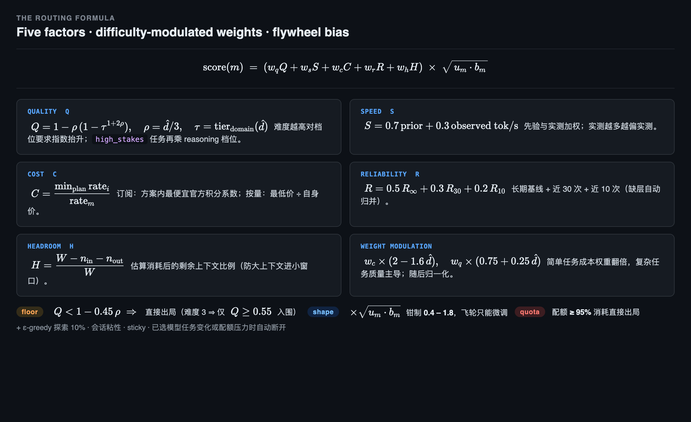

<div align="center">

# EvolveRoute

**A local LLM routing gateway with a decision model at its core. It evolves with every request.**

[](LICENSE)
[](https://www.rust-lang.org)
[](#development)

[English](README.md) | [中文](README.zh-CN.md)

</div>

---

**EvolveRoute** 是一个本地部署的智能路由网关，架在你的编码 Agent 与所有 LLM Provider 之间。它不把每个请求都发给「最强」的模型——而是**逐请求实时判定，送到此刻最合适的那一个**：

- **任务画像**：决策模型（[TypeSafe Jev](https://github.com/typesafe-ai) + 多语言启发式第二意见，取严融合）按 8 维信号判定（领域、难度、视觉、工具密度、高风险…）
- **方案画像**：每个候选按其方案自己的货币先计价再评分（积分/美元/AFP），叠加订阅配额窗口和 5 因子科学公式
- **可归因**：每条边、每个分、每道降级都带名带值，全程可审计

一个 Rust 单二进制装在本地，**用户数据不离开主机**，决策日志全量留痕，飞轮从每次结果中学习、越用越准。

---

 align="center">

# EvolveRoute

**A local LLM routing gateway with a decision model at its core. It evolves with every request.**

[](LICENSE)
[](https://www.rust-lang.org)
[](#development)

[English](README.md) | [中文](README.zh-CN.md)

</div>

---

**EvolveRoute** is a single-binary gateway that sits between your coding agents and your LLM providers. Point your agents at `http://127.0.0.1:8787` with `model = "auto"` — for every request, a decision model judges the task (domain, difficulty, vision, tool-density, stakes…) and routes it to the best *fitting* model: cheap models for chit-chat, strong models for complex refactors, and **oversized contexts never enter small-window models**. Everything is observable: why it routed, where it went, what it cost.

It is **local-first** (no cloud dependency for routing), **economics-aware** (subscription quotas, credit multipliers, per-model dollar limits), and **self-evolving** (a flywheel learns from every outcome and rewrites its own scoring biases).


*Agents point at one endpoint with `model = "auto"`. The dual judge (TypeSafe Jev + heuristic) scores every request; the flywheel feeds every outcome back into ranking; every provider plan is priced and budgeted its own way. [Edit the source](docs/assets/architecture.excalidraw).*

## Three pillars

1. **Intelligent decisions, not prefix rules.** Every request is judged by a decision model — **[TypeSafe Jev](https://github.com/typesafe-ai)** — on 8 signals (domain, difficulty, needs-vision, triviality, tool-density, high-stakes, session depth, size). A built-in multilingual heuristic judge runs as an independent second opinion (take-conservative fusion, covering Jev's CJK blind spots); if Jev is unreachable, the heuristic takes over and **routing never blocks**. Optional `laya` backend slots into the same interface.
2. **Budget-aware routing.** Every candidate is priced in its plan's own currency — credits (zhipu / Z.ai / MiniMax), dollars (opencode zen Go), AFP (volces) — before it is scored. Quota budget protection runs at three levels: **>60%** of your allowance deprioritizes the plan, **>85%** breaks session stickiness, **>95%** filters it out entirely — preserving headroom for the tasks that actually need it.
3. **Managed plans in one dashboard.** Vendor subscription plans are first-class citizens: tiers, allowances, credit multipliers and per-model dollar limits are built in; the dashboard shows live provider-reported quotas per window with one-click reconciliation.

## Managed plans

| Plan | Vendor | Kind | Pricing model | Tiers | Windows |
|---|---|---|---|---|---|
| `zhipu-coding` | zhipu (bigmodel.cn) | Coding Plan | credits, off-peak 50% | lite / pro / max | 5h · week · month |
| `zai-devpack` | Z.ai | Coding Plan | credits | lite / pro / max | 5h · week · month |
| `opencode-go` | opencode zen | Go Plan | $/1M per model + per-model monthly $ cap | go / go-plus | month (5h = 20%) |
| `volces-coding` | volces | Coding Plan | AFP credits | lite / pro | 5h · week · month |
| `volces-agent` | volces | Agent Plan | AFP credits | — | 5h · week · month |
| `minimax-coding` | MiniMax | Coding Plan | credits | lite / pro / max | 5h · week · month |
| pay-as-you-go | any OpenAI / Anthropic | API | $ per token | — | — |

Plans are auto-detected from base URLs, and every window (5h / weekly / monthly) is tracked with provider-truth quota headers where the vendor reports them.

## Why EvolveRoute

| | EvolveRoute | LiteLLM / OpenRouter | RouteLLM |
|---|---|---|---|
| **Routing decision** | Decision model judges *every request* (8 signals) + heuristic second opinion, fail-open | Config/prefix rules, or model-based router trained offline | Trained router models, offline |
| **Self-evolution** | Flywheel: 4-layer feedback (transport / tool-syntax / semantic loop / plugin) rewrites per-model learned bias & reliability | Static weights | Static after training |
| **Subscription economics** | Per-plan credit multipliers, tier allowances (5h/week/month), quota budget protection (soft-deprioritize → sticky-break → hard-filter) | Cost tracking only | – |
| **Deployment** | One Rust binary (~7 MB), zero deps, no Docker/DB | Python + DB | Python |
| **Protocol** | OpenAI ↔ Anthropic bidirectional translation (incl. streaming) | OpenAI-centric | OpenAI |
| **Multi-agent** | Native identity for opencode / codex / claude-code / pi (session-aware stickiness) | Generic | Generic |
| **Failure handling** | Multi-key pools → per-provider & per-endpoint circuit breaking → fallback chain → **out-of-chain last-resort sweep** | Retries | – |

## Features

1. **本地部署，数据安全** — 一个 Rust 单二进制（~7 MB），零运行时依赖，无 Docker、无 Python、无云。整条路由链全在主机内：用户数据、会话内容、遥测信号**不出网**。每一次决策落入本地 JSONL 事件日志——审计、迁移、删除全部可控。
2. **决策模型智能判断，懂经济账** — TypeSafe Jev 主判 + 多语言启发式独立第二意见（取严融合，弥补 Jev 在 CJK 场景的盲区），判 8 维信号；Jev 不可达时启发式接管，**路由永不阻塞**。每个候选评分前先按**其方案自有货币**计价（智谱 / Z.ai / MiniMax 积分、opencode Go 美元、volces AFP），再复合质量 / 速度 / 成本 / 可靠 / 余量五因子。三层预算保护：>60% 降权、>85% 断粘性、>95% 出局。
3. **科学公式归因** — 5 因子 + 难度联动权重 + 飞轮偏置，
4. **自进化飞轮** — 每次请求喂入飞轮，4 层反馈（传输成败 / 工具调用语法 / 会话语义回路 / 插件显式上报）改写各模型的 learned bias、可靠性、token 校准——长记忆 + 短期 + 即时三层融合（50% / 30% / 20%）。**用量越大、路由越准**。
5. **多 Agent 多 Provider, OpenAI ↔ Anthropic 无损** — opencode / Claude Code / Codex / Pi 任一接入（OpenAI 或 Anthropic 协议），路由到任何 OpenAI 兼容 **或** Anthropic 上游；Switchyard **双向流式翻译**（含事件映射与确定性 ID），Claude Code 开箱即用。订阅方案（zhipu coding / Z.ai / opencode zen / volces / MiniMax）与按量 API 共用同一端点。
6. **极速决策，零依赖部署** — 单 Rust 二进制 6.7 MB；冷启动 <30 ms；单请求仅多 <300 ms（一次 Jev 评分 + 启发式兜底）。多 key 池化轮换、provider / 端点双层熔断、链外兜底扫描——单家 Provider 全挂也不会整体哑掉。
7. **本地面板管控，全程决策可见** — 零构建面板 `http://127.0.0.1:8787`：实时决策流（每行附大白话归因）、评分矩阵、降级链与每跳剔除原因、耗时瀑布、模型趋势、Provider 与配额管理、飞轮学习状态。所有响应携带 `x-ev-model / x-ev-reason / x-ev-decision-id` 头；`/api/events` 暴露 JSONL 决策日志，可查询可回放。

# Quick Start

**Requirements:** Rust stable (2024 edition), any OpenAI-compatible or Anthropic provider credentials.

```bash
git clone https://github.com/your-org/evolve-route.git
cd evolve-route
cargo build --release

# binary at target/release/evolveroute
./target/release/evolveroute serve
# gateway listening on http://127.0.0.1:8787
```

Configuration lives at `~/.evolveroute/evolveroute.toml` (a default is embedded and written on first run). Point providers with their base URLs and API keys:

```toml
[server]
host = "127.0.0.1"
port = 8787

[[models]]
id = "zhipuai-coding-plan/glm-5.3"
provider = "zhipuai-coding-plan"
base_url = "https://open.bigmodel.cn/api/coding/paas/v4"
api_key_env = "ZHIPU_API_KEY"
upstream_model = "glm-5.3"
context_window = 1024000
cost = { input = 0.0, output = 0.0 }   # plan models: marginal cost ≈ 0
```

### Connect your agents

**opencode** (`~/.config/opencode/opencode.jsonc`):

```jsonc
{
  "provider": {
    "evolveroute": {
      "npm": "@ai-sdk/openai-compatible",
      "options": { "baseURL": "http://127.0.0.1:8787/v1" },
      "models": {
        "auto": {
          "name": "Auto (smart routing)",
          "attachment": true,
          "reasoning": true,
          "tool_call": true
        }
      }
    }
  }
}
```

**Claude Code:**

```bash
export ANTHROPIC_BASE_URL=http://127.0.0.1:8787
export ANTHROPIC_MODEL=auto
claude
```

**Any OpenAI-compatible client:** base URL `http://127.0.0.1:8787/v1`, model `auto`.

### Run as a service (macOS LaunchAgent)

```bash
evolveroute service install   # also: start / stop / restart / status
```

## The dashboard

Open `http://127.0.0.1:8787/`:


- **Live decision stream** — every request with its 8-signal judgment, chosen model, and a plain-language reason
- **Scoring matrix** — top candidates with per-factor scores (quality / speed / cost / reliability / headroom)
- **Fallback chains** — which models were tried, which failed, and exactly why
- **Latency waterfall** — preprocess / decision / TTFT / streaming, per request
- **Provider management** — add/edit/scan providers, tier allowances (5h/week/month), live provider-reported quotas, one-click reconciliation
- **Flywheel card** — learned bias, observed reliability, calibration, semantic confirmations per model

## How routing decisions work

```
request → estimate tokens → hard constraints (window / vision / credentials)
        → decision model judge (8 signals, heuristic backup)
        → quality floor → composite score (difficulty-linked weights)
        → ε-greedy exploration (10%) → session stickiness check
        → route → observe outcome → feed the flywheel
```

Deep dives: [Architecture](docs/ARCHITECTURE.md) · [Decision flow](docs/DECISION-FLOW.md) · [Scoring factors](docs/FACTORS.md) · [Modules](docs/MODULES.md) *(Chinese, English translation welcome)*

## The routing formula

## Development

```bash
cargo build --release
cargo test          # 94 tests
cargo clippy        # zero warnings policy
```

Workspace layout:

| Crate | Role |
|---|---|
| `ev-core` | Decision engine, scoring, catalog, plan registry, config |
| `ev-decision` | Decision-model backends (TypeSafe Jev, laya, heuristic) + protocol translation |
| `ev-discovery` | Agent config scanning, remote /models fetching, models.dev enrichment |
| `ev-memory` | Flywheel, quota ledger, health registry, session store, event log |
| `ev-server` | Axum gateway, relay, dashboard, provider APIs, CLI |

See [CONTRIBUTING.md](CONTRIBUTING.md) for guidelines.

## License

[MIT](LICENSE)
