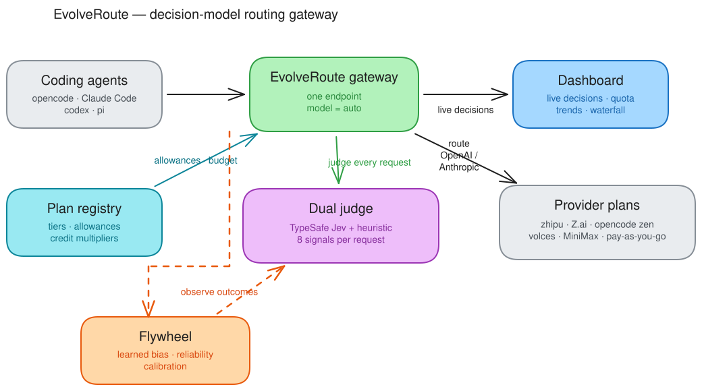
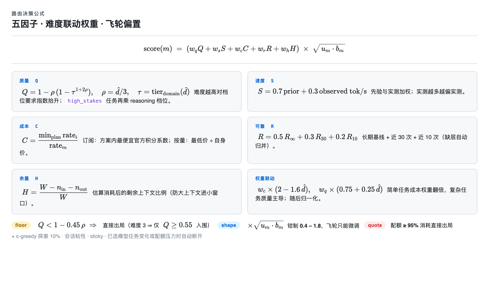
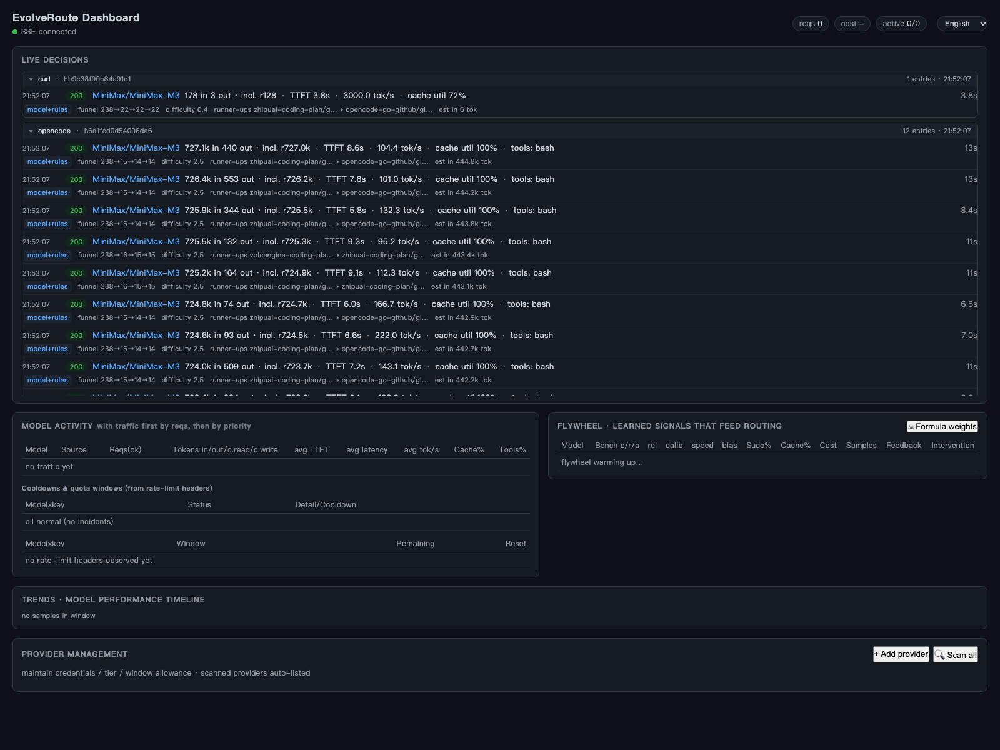

<div align="center">

# EvolveRoute

**本地优先的 LLM 路由网关，内建决策模型，每次请求都在进化。**

[](LICENSE)
[](https://www.rust-lang.org)
[](#开发)

[English](README.md) | [中文](README.zh-CN.md)

</div>

---

> **不选最好的模型——选最合适的。**
>
> 一个本地部署的 LLM 智能路由网关：决策模型逐请求判定任务画像，飞轮从每次结果中学习，科学公式保证每次决策可追溯。**你的数据从不出主机。**

**EvolveRoute** 是一个本地优先的智能路由网关，架在你的 Agent 与所有 LLM Provider 之间——opencode / Claude Code / Codex / Pi / openclaw / hermes / dsh 及任何 OpenAI、Anthropic 兼容客户端都开箱接入。它不把每个请求都发给「最好的」模型——而是按任务画像（决策模型 TypeSafe Jev + 多语言启发式第二意见，取严融合，逐请求判 8 维信号）**实时判 每次请求最合适的那一个**，并叠加方案画像（每方案自有货币先计价再评分）。**每次请求都喂飞轮**，路由越用越准。

差异化在于——决策**本地、过程透明、可审计**：每条边、每个分、每道降级都带名带值（`x-ev-model / x-ev-reason / x-ev-decision-id` 头 + JSONL 事件日志 + 零构建面板）；用户数据从不出主机。决策模型不可达时启发式接管，**路由永不阻塞**。



*各 Agent 指向单一端点 `model = "auto"`。双判官（TypeSafe Jev + 启发式）逐请求评分；飞轮把每次结果喂回排名；每个 Provider 方案按各自货币计价与预算。[编辑源文件](docs/assets/architecture.excalidraw)。*

## 为什么不是另一个 proxy

| | EvolveRoute | LiteLLM / OpenRouter | RouteLLM |
|---|---|---|---|
| **路由决策** | 决策模型**逐请求实判**（8 维信号）+ 启发式第二意见，判败不阻塞 | 配置/前缀规则，或离线训练的模型路由 | 离线训练路由模型 |
| **自进化** | 飞轮：四层反馈（传输/工具语法/语义回路/插件）自动改写模型级学习偏置与可靠性 | 静态权重 | 训练后即静态 |
| **订阅经济学** | 方案级积分系数、档位额度（5h/周/月）、配额预算三层保护（降权→断粘性→硬过滤） | 仅成本记录 | – |
| **部署** | 单 Rust 二进制（~7MB），零依赖，无 Docker/数据库 | Python + 数据库 | Python |
| **协议** | OpenAI ↔ Anthropic 双向翻译（含流式） | OpenAI 为主 | OpenAI |
| **多 Agent** | 原生识别 opencode / codex / claude-code / pi / openclaw / hermes / dsh（会话感知粘性） | 通用 | 通用 |
| **故障处理** | 多 key 池化 → provider/端点级熔断 → 降级链 → **链外兜底扫描** | 重试 | – |


## 路由决策公式


## 三大支柱

1. **智能决策，而非前缀规则。** 每个请求都由决策模型——**[TypeSafe Jev](https://github.com/typesafe-ai)**——判定 8 维信号（领域、难度、视觉、trivial、工具密度、高风险、会话深度、体量）。内置多语言启发式判官作为独立第二意见（取严融合，补 Jev 的中文短板）；Jev 不可达时启发式接管，**路由永不阻塞**。可选 `laya` 后端插入同一接口。
2. **资金感知路由。** 每个候选先用其方案自己的货币计价——积分（智谱 / Z.ai / MiniMax）、美元（opencode zen Go）、AFP（火山）——再进入评分。配额预算三层保护：额度消耗 **>60%** 降权、**>85%** 断开会话粘性、**>95%** 直接出局——把余量留给真正需要的任务。
3. **大模型方案，一个面板管控。** 厂商订阅方案是一等公民：档位、额度、积分系数、每模型美元限额全部内置；面板按窗口展示 Provider 实测配额，一键对账。


## 内置方案

| 方案 | 厂商 | 类型 | 计价模型 | 档位 | 窗口 |
|---|---|---|---|---|---|
| `zhipu-coding` | 智谱 (bigmodel.cn) | Coding Plan | 积分，闲时 5 折 | lite / pro / max | 5h · 周 · 月 |
| `zai-devpack` | Z.ai | Coding Plan | 积分 | lite / pro / max | 5h · 周 · 月 |
| `opencode-go` | opencode zen | Go Plan | 每模型 $/1M + 每模型月度美元限额 | go / go-plus | 月（5h = 20%） |
| `volces-coding` | 火山方舟 | Coding Plan | AFP 积分 | lite / pro | 5h · 周 · 月 |
| `volces-agent` | 火山方舟 | Agent Plan | AFP 积分 | — | 5h · 周 · 月 |
| `minimax-coding` | MiniMax | Coding Plan | 积分 | lite / pro / max | 5h · 周 · 月 |
| 按量计费 | 任意 OpenAI / Anthropic | API | $ / token | — | — |

方案按 base URL 自动识别；每个窗口（5h / 周 / 月）均有跟踪，厂商下发配额头时以 Provider 实测为准。


## 功能

- **本地部署，数据安全** — 单 Rust 二进制（~7 MB），零运行时依赖，无 Docker、无 Python、无云。整条路由链全在主机内：用户数据、会话内容、遥测信号**不出网**。每一次决策落入本地 JSONL 事件日志——审计、迁移、删除全部可控。
- **决策模型智能判断，懂经济账** — 决策模型（TypeSafe Jev + 多语言启发式第二意见，取严融合）按 8 维信号（领域、难度、视觉、工具密度、高风险…）判定任务画像；每个候选评分前先按**其方案自有货币**计价（智谱 / Z.ai / MiniMax 积分、opencode Go 美元、volces AFP），再复合质量/速度/成本/可靠/余量五因子。三层预算保护：>60% 降权、>85% 断粘性、>95% 出局。
- **科学公式归因** — 5 因子（质量·速度·成本·可靠·余量）+ 难度联动权重 + 飞轮偏置——完整推导见下方「[路由决策公式](#路由决策公式)」。每项都能逐行追溯，不是黑盒。
- **自进化飞轮** — 每次请求喂入飞轮，4 层反馈（传输成败 / 工具调用语法 / 会话语义回路 / 插件显式上报）改写各模型 learned bias、可靠性、token 校准——长记忆 + 短期 + 即时三层融合（50% / 30% / 20%）。**用量越大、路由越准**。
- **多 Agent + 多 Provider 适配** — opencode / Claude Code / Codex / Pi（编码 Agent），openclaw / hermes / dsh（本地 Harness），任何 OpenAI / Anthropic 兼容客户端都**无需改代码**接入。路由到任何 OpenAI 兼容**或** Anthropic 上游；Switchyard 双向流式翻译（含事件映射与确定性 ID），Claude Code 开箱即用。订阅方案（zhipu coding / Z.ai / opencode zen / volces / MiniMax）与按量 API 共用同一端点。
- **极速决策，零依赖部署** — 单 Rust 二进制 6.7 MB；冷启动 <30 ms；单请求仅多 <300 ms（一次 Jev 评分 + 启发式兜底）。多 key 池化轮换、provider / 端点双层熔断、链外兜底扫描——单家 Provider 全挂也不会整体哑掉。
- **本地面板管控，全程决策可见** — 零构建面板 `http://127.0.0.1:8787` 暴露：实时决策流（每行附大白话归因）、评分矩阵、降级链与每跳剔除原因、耗时瀑布、模型趋势、Provider 与配额管理、飞轮学习状态。所有响应携带 `x-ev-model / x-ev-reason / x-ev-decision-id` 头；`/api/events` 暴露 JSONL 决策日志可查询可回放。

## 快速开始

**要求：** Rust stable（2024 edition），任意 OpenAI 兼容或 Anthropic Provider 凭据。

```bash
git clone https://github.com/your-org/evolve-route.git
cd evolve-route
cargo build --release

# 二进制在 target/release/evolveroute
./target/release/evo-router serve
# 网关监听 http://127.0.0.1:8787
```

配置位于 `~/.evolveroute/evolveroute.toml`（内置默认配置，首次运行自动写出）。填入 Provider 的 base URL 与 API key：

```toml
[server]
host = "127.0.0.1"
port = 8787

[[models]]
id = "zhipuai-coding-plan/glm-5.3"
provider = "zhipuai-coding-plan"
base_url = "https://open.bigmodel.cn/api/coding/paas/v4"
api_key_env = "ZHIPU_API_KEY"
upstream_model = "glm-5.3"
context_window = 1024000
cost = { input = 0.0, output = 0.0 }   # 订阅方案：边际成本 ≈ 0
```

### 接入你的 Agent

**opencode**（`~/.config/opencode/opencode.jsonc`）：

```jsonc
{
  "provider": {
    "evolveroute": {
      "npm": "@ai-sdk/openai-compatible",
      "options": { "baseURL": "http://127.0.0.1:8787/v1" },
      "models": {
        "auto": {
          "name": "Auto (smart routing)",
          "attachment": true,
          "reasoning": true,
          "tool_call": true
        }
      }
    }
  }
}
```

**Claude Code：**

```bash
export ANTHROPIC_BASE_URL=http://127.0.0.1:8787
export ANTHROPIC_MODEL=auto
claude
```

**任意 OpenAI 兼容客户端：** base URL `http://127.0.0.1:8787/v1`，model `auto`。

### 以服务方式运行（macOS LaunchAgent）

```bash
evolveroute service install   # 另有：start / stop / restart / status
```


## 面板

打开 `http://127.0.0.1:8787/`：



- **实时决策流**——每个请求的 8 维判定、所选模型、大白话归因
- **评分矩阵**——头部候选的分因子得分（质量/速度/成本/可靠/余量）
- **降级链**——试了哪些模型、挂在哪、为什么
- **耗时瀑布**——预处理/决策/TTFT/流式，逐请求
- **Provider 管理**——增删/扫描 Provider、档位额度（5h/周/月）、Provider 实测配额、一键对账
- **飞轮卡**——各模型的学习偏置、实测可靠性、校准值、语义确认数


## 路由决策原理

```
请求 → token 估算 → 硬约束（窗口/视觉/凭据）
    → 决策模型判定（8 维，启发式兜底）
    → 质量及格线 → 复合评分（难度联动权重）
    → ε-greedy 探索（10%）→ 会话粘性检查
    → 路由 → 结果观测 → 喂给飞轮
```

深入阅读：[架构](docs/ARCHITECTURE.md) · [决策流](docs/DECISION-FLOW.md) · [评分因子](docs/FACTORS.md) · [模块](docs/MODULES.md)


## 开发

```bash
cargo build --release
cargo test          # 94 个测试
cargo clippy        # 零警告策略
```

Workspace 结构：

| Crate | 职责 |
|---|---|
| `ev-core` | 决策引擎、评分、目录、方案注册表、配置 |
| `ev-decision` | 决策模型后端（TypeSafe Jev、laya、启发式）+ 协议翻译 |
| `ev-discovery` | Agent 配置扫描、远程 /models 拉取、models.dev 补全 |
| `ev-memory` | 飞轮、配额账本、健康注册表、会话存储、事件日志 |
| `ev-server` | Axum 网关、relay、面板、Provider API、CLI |

贡献指南见 [CONTRIBUTING.md](CONTRIBUTING.md) / [CONTRIBUTING.zh-CN.md](CONTRIBUTING.zh-CN.md)。


## 许可证

[MIT](LICENSE)
